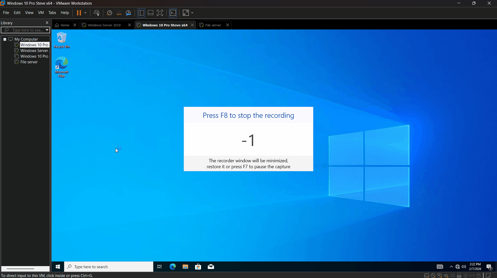
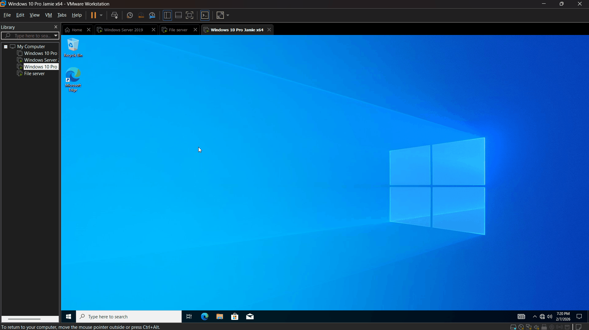

# Enforcing User Security Policy in Isolated Domain Environment

## Objective
This lab focuses on Microsoft's Active Directory Domain Services, with the intent to configure User security policy to safeguard accounts and set strict boundaries between the following two Organizational Units:
- Information Technology
- Human Resources

Enacted security policy includes:
- Minimum password length at 12 characters. As recommended by the NIST SP 800-63B. Note: AD Group Policy does not allow 15 character as a minimum (only up to 14). Using the SP 800-63B as reference, I believe 12 characters with complexity is sufficient.
- Enforced password complexity.
- Lockout policy: 3 attempts given, 10 minute lockout if failed. 
- Map shared folder to drive for each Organizational Unit:
  - Information Technology security group: "it" shared folder mapped to I:\
  - Human Resources security group: "hr" shared folder mapped to H:\

## Demonstrations

### Account Lockout Policy
- 3 Attempts before account gets locked, includes domain Administrator account. 

> Steve forgets his password and gets locked out of his account.
Steve (Information Technology OU) lockout demonstration:

AD Administrator lockout demonstration:

### Minimum Password Policy
- 12 character minimum passwords enforced globally. 

- Steve is told to create a new password as his old password (S1234@) is unsafe. 
- In the demonstration he tries to change it to "MyNewPassword" but is rejected as it doesn't meet complexity requirements.
- He finally settles on "MyNewPa$$word1" which meets requirements.
- Note: I do not endorse "MyNewPa$$word1" as a good password. In fact, according to "passwordmonster.com", this password can be cracked in 14 seconds. It is only used as an example of a password that meets policy. 

Steve password complexity/length requirement demonstration:

### Shared Network Folders Mapped to Drives
- Map respective shared folders to a drive automatically for users.

- Steve, being in the IT department, looks at his assigned shared folder.
- Steve also attempts to access the HR shared folder, which he does not have access to. 

Steve accessing mapped drive demonstration:

- Jamie, being in the HR department, looks at his assigned shared folder.
- Jamie also attempts to access the IT shared folder, which he does not have access to.

Jamie accessing mapped drive demonstration:

### Group Policy Management
- Show off how Group Policy Objects are organized within the Group Policy Management tool.

Group Policy Object organization demonstration:
![Gif showing the Group Policy Objects within the Group Policy Management tool. Password and lockout policies are within the global "Default Domain Policy" object. Within the "UserOU" organizational unit sits two seperate domain policy: "Disable Control Panel", which disables control panel for all users who are not Administrators and "Map Network Drive" which maps the shared folders to their respected users. Maps the shared folder "hr" to "H:\" for HR user accounts and maps the shared folder "it" to "I:\" for IT user accounts.](./Gifs/GroupPolicyManagementDemo.gif)

## Summary
This lab demonstrates the use of AD DS to enforce security policy on user objects such as password, lockout, control panel, and mapped drive policy. 

This lab used VMWare Workstation Pro and initialized 4 virtual machines:
- Active Directory Domain Controller. Created domain and enforced/enabled user policy.
- File Server (Windows Server 2019). Joined domain and only holds folders that is shared to respective Organizational Units. 
- 2 Client Windows 10 Pro machines, one for user "Steve Steven" and "Jamie Jamieson" which are in the "Information Technology" and "Human Resources" security groups respectively. 